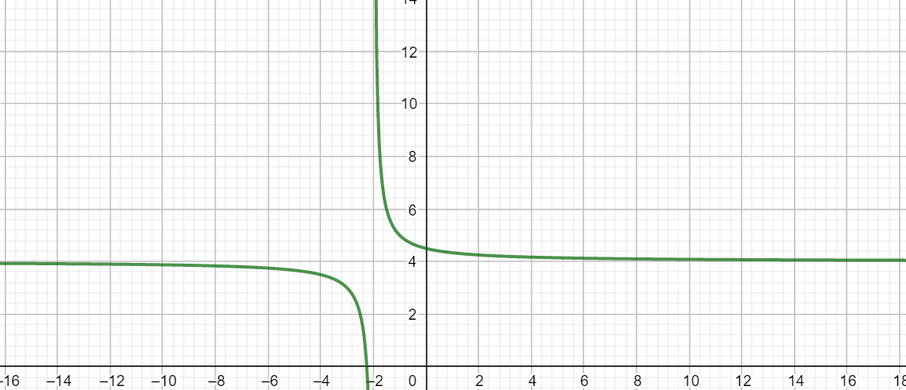
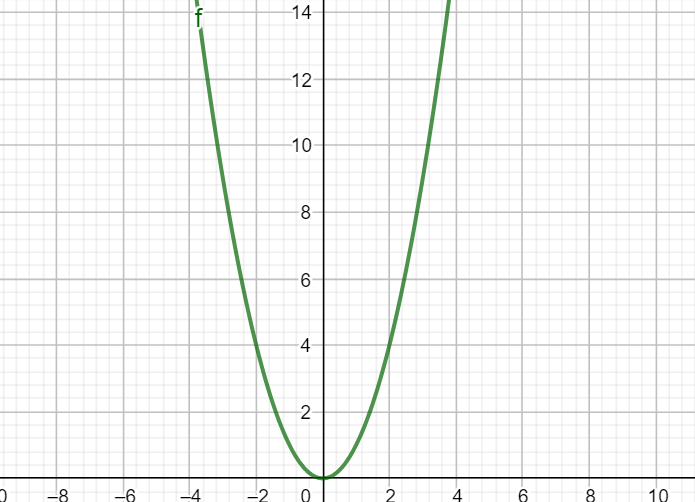
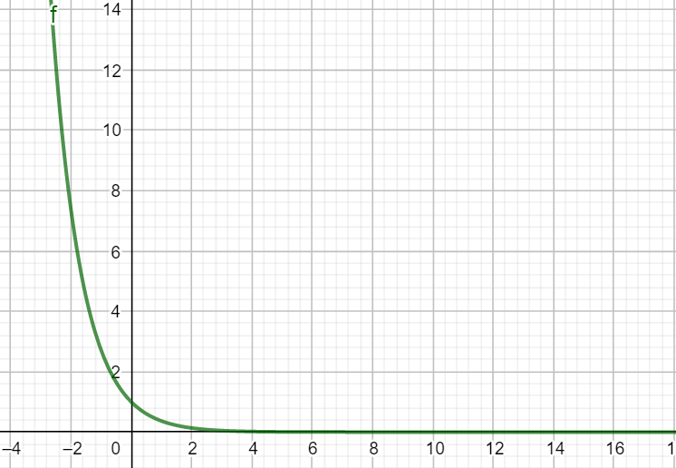

# Chapitre 1 - Limites de fonctions 

> Cours 
> [Chap 1](./cours/Cours-Chap1.pdf)

## Définition de limites 
### Limites en $+\infty$

>Etude de la limite graphiquement  
>Sur les graphiques ci-dessous, donner les limites de $f$ lorsque $x$ tend vers $+\infty$ 
>
>
>
>
>
>
>

### Limites en $+\infty$

>Même question lorsque $x$ tend vers $-\infty$

