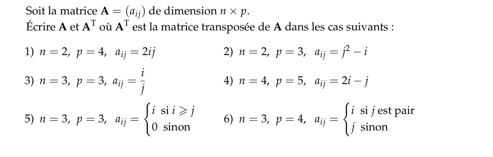

# MATHS EXPERTES - OPTION TERMINALE

Page regroupant les documents des cours de l'option Maths Expertes.  
L'option est évaluée en controle continu.
## Manuel Numérique 
[livre scolaire](https://fr.calameo.com/read/0005967295d0b5d5c47f6?authid=nDfde6HMoRP5 "Livre spé Maths")
## Chapitre 1 - Les complexes point de vue algébrique

!!! info "Cours" 
    [Cours](./cours/MEXP/Chap1/Cours-Chap1.pdf)

!!! note "Activité de découverte"
    Activité A p18  
    Remarque : cette activité est difficile par rapport au reste du chapitre, il est interessant de voir comment l'idée d'un nombre au carré négatif.  

!!! note "Forme algébrique"
    N°26-27-29p34  
    N°61-62p36  
    N°64p36  
    
!!! note "Formule de Newton" 
    N°66p37  
    

!!! note "Nombre complexe conjugué-inverse et quotient de nombres complexes"
    === "Exercices :"
        N°79p38  
        N°80-81p38  
        N°84-85-86p38
    === " Correction :"
        [correction 85 p38](./cours/MEXP/Chap1/Ex_85.jpg)

    
!!! note "Equations" 
    N°31-32p34  
    N°33-34p34  
    N°94-96p39  
    N°43-44p35  
    N°110-111p40  
    N°113p41

!!! note "Factorisation de polynômes"
    N°118-119p41  
    N°120-121p41  
    N°124-125p42

## Chapitre 2 - Arithmétique - Divisibilité dans $\mathbb{Z}$
!!! info "Cours" 
    Le cours [Cours](./cours/MEXP/Chap2/Cours_Chap2.pdf)   

!!! alerte "devoir 2022"
    [Eval](./cours/MEXP/Chap2/eval.pdf)  
    [corrige](./cours/MEXP/Chap2/Ds1-divisibilite.pdf)  
    
!!! note "Activité de découverte"
    N°1-2-6-8p90  
    
!!! note "Divisibilité dans $\mathbb{Z}$"
    N°26-27p104  
    N°30-31-32-33p104  
    N°35-29-36p104  
    N°61-62-65p106  
    N°67-68p107  
    N°69-70-71p107  

!!! note "Division Euclidienne"
    Activité Bp92  
    N°20-21-22-23-24p 104  
    N°40-41p105  
    N°79-80p107  
    N°81-84-86p108  
    N°88-89p108  
    
!!! note "Congruence"
    N°47-48-49p105  
    N°92-93p109
    N°99p109  
    N°50-51-52-53p105  
    N°102-103-104p110  
    N°106-108-109p110
    N°115-116-117p111
    
!!! note "Chiffrement"
    N°119p112
    
## Chapitre 3 - Matrices et application aux graphes
!!! info "Cours" 
    Le cours [Cours](./cours/MEXP/Chap3/Cours-chap3.pdf)   

    
!!! note "Construction de matrices"
    
    
    
!!! note "Calculs matriciels"
    N°20-22-23-24 p190  
    N°44 p192
    N°47 p193

!!! note "Inverse de matrices et applications"
    N°26-28-29 p190
    N°49-50-52-53 p193

!!! note "Transformations géométriques "
    En construction
!!! note "Les graphes "
    En construction

## Chapitre 4 - Les complexes point de vue géométrique
!!! info "Cours" 
    Le cours [Cours](./cours/MEXP/Chap4/Cours-Chap4.pdf)

!!! note "Rappels"
    N°1-5-6 p48  

!!! note " Géométrie et complexes"
    A p50  
    N°26-27-28 p66  

!!! note " Module et argument"
    N°29-30-31-32 p67
    N°60 p69 
    N°68 p70
!!! note " forme trigonometrique"  
    N°33-34 p67  
    N°73-74-75 p70  

!!! note " forme exponentielle"  
    N°36 p67  
    N°92-93-91p72
!!! note " applications à la géométrie"
    N°96-98 p73  
    N°82-83p71  
    N°37-38-39-40p 67
    N°112-116-118p74   
    N°121-122-123p75

!!! note "Racines de l'unité "
    N°44-45p67  
    N°125-126-127p 75
    
<!--

## Chapitre 4 - Les complexes point de vue géométrique
??? info "Cours" 
    Le cours [Cours](./cours/MEXP/Chap4/Cours-Chap4.pdf)
    
## Chapitre 5- Graphes et Suites de matrices
??? info "Cours" 
    Le cours [Cours](./cours/MEXP/Chap5/Cours-Chap5.pdf)
    
## Chapitre 6- PGCD et applications
??? info "Cours" 
    Le cours [Cours](./cours/MEXP/Chap6/Cours_Chap6.pdf)
-->
